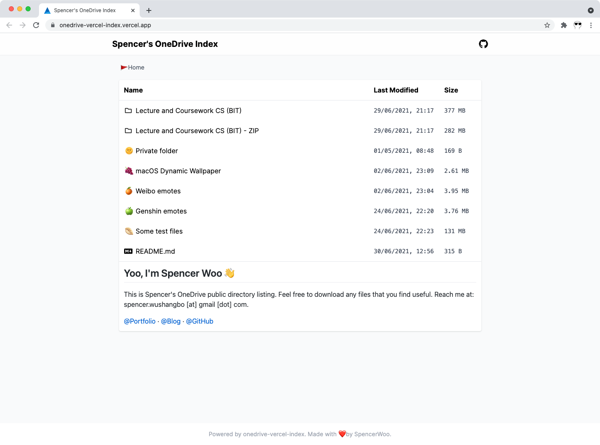

  
  <h3><a href="https://drive.spencerwoo.com">onedrive-vercel-index</a></h3>
  
<em>OneDrive public directory listing, powered by Vercel and Next.js</em>

  
  
  
  
  

## TL;DR

Showcase, share, preview, and download files inside *your* OneDrive with onedrive-vercel-index -

- Completely free to host 💸
- Fast ⚡ and responsive 💦
- Takes less than 15 minutes to setup ⏱️
- Highly customisable ⚒️

🍌 More importantly, we are pretty (●'◡'●)

## Discussion

Please go to our [discussion forum](https://github.com/spencerwooo/onedrive-vercel-index/discussions) for general questions and FAQs, **issues are for bug reports and bug reports only.** Feature requests may or may not be ignored, as [I (@spencerwooo)](https://spencerwoo.com) am the only one maintaining the project, so **I only prioritise features that I use.**

*If you happen to like this project, please give it a star!* :3

*If you really, really like this project, please send money! -> [Sponsors 🤑 and donations 💰](https://docs.spencerwoo.com/please-donate)*

## Demo

Live demo at [Spencer's OneDrive](https://drive.spencerwoo.com).

## Features

<table>
  <tbody>
    <tr>
      <td>
        <a
          href="https://drive.spencerwoo.com/Lecture%20and%20Coursework%20CS%20(BIT)/2019%20-%20%E5%A4%A7%E4%B8%89%E4%B8%8B%20-%20%E7%BC%96%E8%AF%91%E5%8E%9F%E7%90%86%E4%B8%8E%E8%AE%BE%E8%AE%A1/n1570.pdf"
          >👀 File preview</a
        >
      </td>
      <td>
        <a
          href="https://drive.spencerwoo.com/%F0%9F%8D%8A%20Weibo%20emotes/Source1/%E5%BE%AE%E5%8D%9A%E2%80%9C%E9%BB%84%E8%84%B8%E2%80%9D"
          >🖼️ Image preview</a
        >
      </td>
      <td>
        <a
          href="https://drive.spencerwoo.com/%F0%9F%8D%A1%20Genshin%20PV/New%20version%20PV/TGA2021%E3%80%8A%E5%8E%9F%E7%A5%9E%E3%80%8B%E5%8F%82%E9%80%89%E8%A7%86%E9%A2%91.mp4"
          >🎥 Video and audio</a
        >
      </td>
    </tr>
    <tr>
      <td>PDF, EPUB, markdown, code, plain text</td>
      <td>Also in gallery mode</td>
      <td>mp4, mp3, ..., play online or with IINA, PotPlayer...</td>
    </tr>
    <tr>
      <td>
        <a
          href="https://drive.spencerwoo.com/Lecture%20and%20Coursework%20CS%20(BIT)/2017%20-%20%E5%A4%A7%E4%BA%8C%E4%B8%8A%20-%20%E6%95%B0%E6%8D%AE%E7%BB%93%E6%9E%84/1%20%E7%BB%AA%E8%AE%BA.pptx"
          >📄 Office preview</a
        >
      </td>
      <td><a href="https://drive.spencerwoo.com/%F0%9F%A5%9F%20Some%20test%20files/Articles">📝 README.md preview</a></td>
      <td><a href="https://drive.spencerwoo.com/%F0%9F%A5%9F%20Some%20test%20files/Imagenette">📑 Pagination</a></td>
    </tr>
    <tr>
      <td>docx, pptx, xlsx, ...</td>
      <td>Also renders code blocks, images with relative links, ...</td>
      <td>For folders with 200 or more items</td>
    </tr>
    <tr>
      <td><a href="https://drive.spencerwoo.com/%F0%9F%8C%9E%20Private%20folder">🔒 Protected folders</a></td>
      <td><a href="https://drive.spencerwoo.com/%F0%9F%8D%8A%20Weibo%20emotes/Source2">⏬ Multi-file download</a></td>
      <td>🔎 Native Search</td>
    </tr>
    <tr>
      <td>Password protected routes and files. <a href="https://docs.spencerwoo.com/password-protected-folders">Details here</a></td>
      <td>
        Compress and download multiple files or folders.
        <a href="https://docs.spencerwoo.com/multi-file-and-folder-download">Details here</a>
      </td>
      <td>
        Searching through your shared OneDrive files (with some caveats 🥺).
        <a href="https://docs.spencerwoo.com/search-for-files-and-folders">Details here</a>
      </td>
    </tr>
  </tbody>
</table>

... and more:

- Streamlined deployment, without having to get your tokens manually anymore!
- Direct raw-file serving and hosting ...
- Full dark mode support, style and website customisations ...

## Documentation

Documentation is hosted at [docs.spencerwoo.com](https://docs.spencerwoo.com/onedrive-vercel-index).

- How can I get started and deploy? - [Docs - Getting started](https://docs.spencerwoo.com/getting-started).
- How can I configure ... ? - [Docs - Custom configs](https://docs.spencerwoo.com/custom-configs).
- Where is feature x ? - [Docs - Features](https://docs.spencerwoo.com/onedrive-vercel-index#ed39fe1746e5444c818c9d2fbc74a378)
- I deployed this before, how can I upgrade to the latest version? - [todo]
- I was here before 2022, how can I migrate to the new version? - [Docs - Migrating from versions before 2022](https://docs.spencerwoo.com/if-you-deployed-before-2022).
- I got a problem during deployment ... - [Docs - FAQ](https://docs.spencerwoo.com/onedrive-vercel-index#aa6b5064e87d4aaea581213a0ea2e3d9)
- I didn't find a solution / My problem is unique - [Find help in discussion forum](https://github.com/spencerwooo/onedrive-vercel-index/discussions).

## Server-*less* (free)?

Yes! Completely free with no backend server what-so-ever. (Well, we use Redis, but that's free to some extent also.)

## Sponsors and donations!

Open-source is hard! If you happen to like this project and want me to keep going, please consider sponsoring me or providing a single donation! Thanks for all the love and support!

[🧸 Please donate - 微信/支付宝](https://docs.spencerwoo.com/please-donate) · [Patreon](https://www.patreon.com/spencerwoo) · [爱发电](https://afdian.net/@spencerwoo)

### Sponsors

*Your name will appear here if you sponsor or donate 😀*

---

**onedrive-vercel-index** ©Spencer Woo. Released under the MIT License.

Authored and maintained by Spencer Woo.

> [@Portfolio](https://spencerwoo.com/) · [@Blog](https://blog.spencerwoo.com/) · [@GitHub](https://github.com/spencerwooo)
